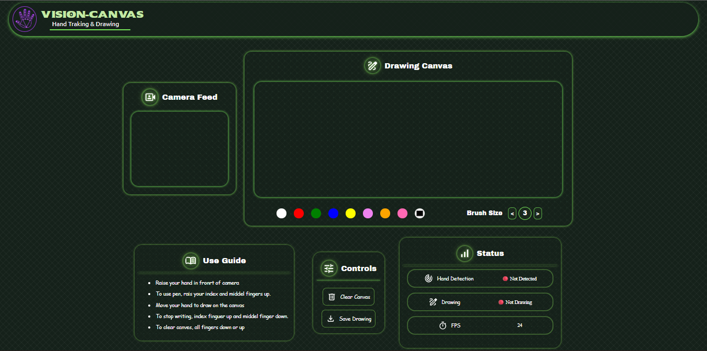

# 🎨 Vision Canvas

### 👨‍💻 Author: **Priyanshu**[YiralcrafT]

- GitHub: https://github.com/yiralcraft0

---

A real-time virtual drawing web application built with **Flask**, **OpenCV**, and **MediaPipe**. Draw in the air using your index finger while viewing both the live camera feed and a digital canvas directly in your browser.

---

## 📖 About

Vision Canvas is a computer vision project that allows users to draw without touching a mouse, stylus, or screen. The application tracks the user's index finger using a webcam and converts its movement into digital drawings on a virtual canvas.

The project combines Python, OpenCV, Flask, and MediaPipe to provide a real-time drawing experience through a web interface.

---

## ✨ Features

- 🖐️ Real-time hand tracking
- ✍️ Air drawing using your index finger
- 🎥 Live webcam feed
- 🎨 Separate drawing canvas
- 🌐 Browser-based interface using Flask
- ⚡ Real-time streaming with minimal latency
- 📱 Easy to run on any desktop browser
- 💾 Save drawing as image

---

## 🛠️ Built With

- Python 3
- Flask
- OpenCV
- MediaPipe
- NumPy
- HTML
- CSS
- JavaScript

---

## 📂 Project Structure

```text
VisionCanvas-web/
├── HandTrakingModule.py
├── LICENSE
├── README.md
├── main.py
├── requirement.txt
├── .gitignore
├── static/
│   ├── app_css/
│   │   ├── base.css
│   │   └── home.css
│   ├── app_js/
│   │   └── home.js
│   ├── images/
│   │   ├── CSSDesign.png
│   │   └── VisionCanvasLogo2.png
│   └── media/
│       └── multipleSvgIcons
│
└── templates/
    ├── base.html
    └── home.html
```

---

## 🚀 Installation

### 1. Clone the repository

```bash
git clone https://github.com/yiralcraft/VisionCanvas.git
```

```bash
cd VisionCanvas
```

---

### 2. Create a virtual environment

- Note :- Python 12 or lower version is required.

Windows

```bash
python -m venv .venv
```

Activate

```bash
.venv\Scripts\activate
```

Linux / macOS

```bash
python3 -m venv .venv
source .venv/bin/activate
```

---

### 3. Install dependencies

```bash
pip install -r requirement.txt
```

---

### 4. Run the application

```bash
python main.py
```

---

### 5. Open your browser

Visit

```
http://127.0.0.1:5600
```

---

## 🖥️ How It Works

1. The webcam captures live video.
2. MediaPipe detects the user's hand landmarks.
3. The index fingertip position is tracked.
4. Finger movement is converted into drawing strokes.
5. Flask streams both the webcam feed and drawing canvas to the browser in real time.

---

## 📸 Preview

| 

---

## 💡 Future Improvements

- Undo & Redo
- Mobile support
- Multiple hand tracking

---

## 🤝 Contributing

Contributions, issues, and feature requests are welcome.

If you'd like to improve the project:

1. Fork the repository
2. Create a feature branch

```bash
git checkout -b feature-name
```

3. Commit your changes

```bash
git commit -m "Add new feature"
```

4. Push your branch

```bash
git push origin feature-name
```

5. Open a Pull Request

---

## 📄 License

This project is licensed under the MIT License.

See the **LICENSE** file for more details.

---

⭐ If you like this project, consider giving it a star on GitHub!
